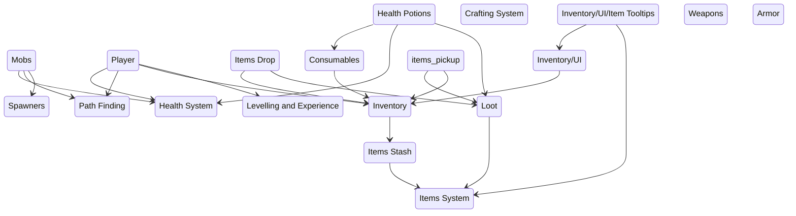

# Mob

# Inventory

# Item Drop

- loot is dropped when a mob is killed
- each mob has a drop table, defines each possible item and a probability of being drop
- Loot can be picked up by the player and it adds an item his inventory
- Loot can be expired after 1

# Exp

# Gold

# Shops

# Quests

# Systems

# Gold
Is dropped by the mobs, is used in trading

